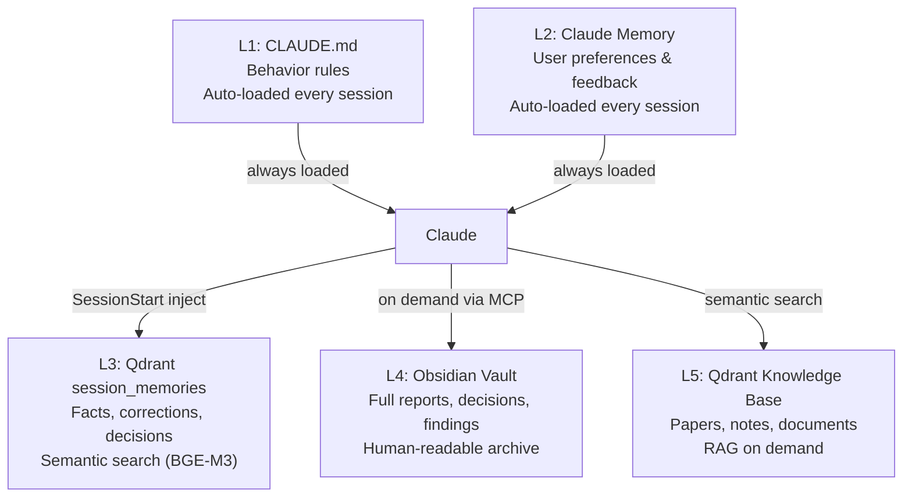
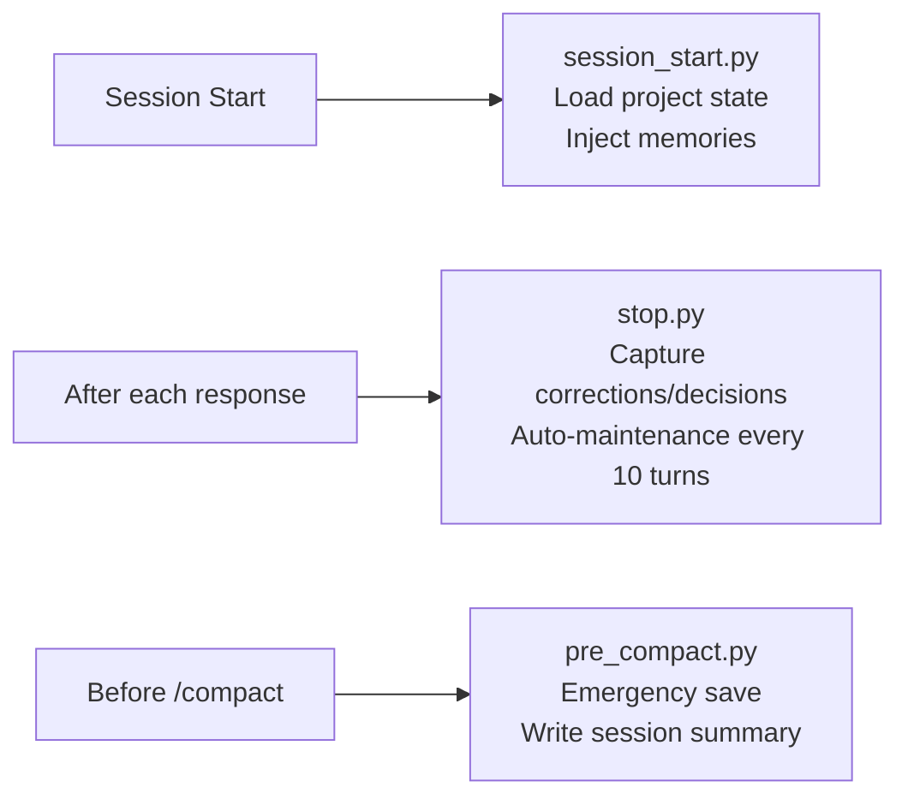
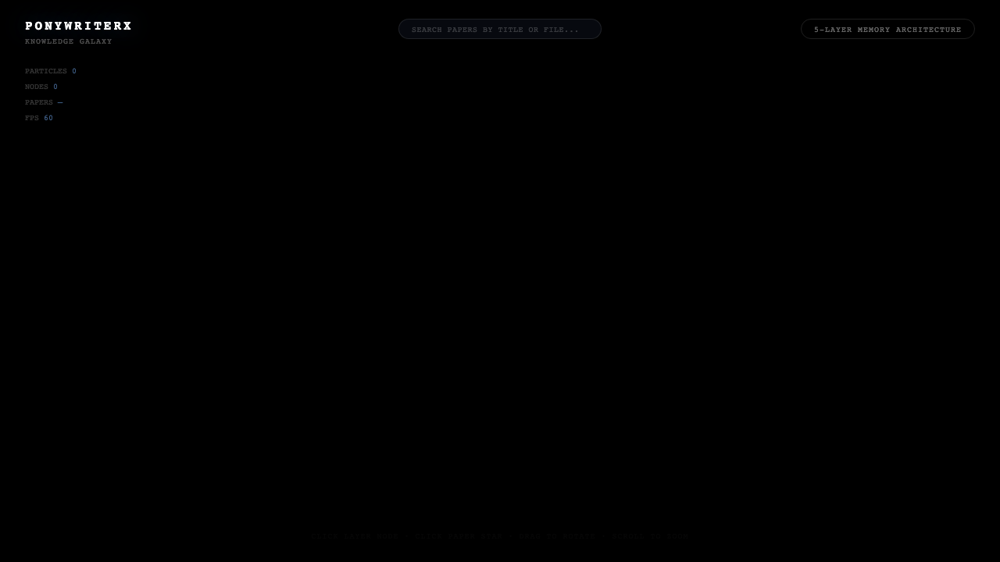

# PonyMemory

**Autonomous 5-tier memory system for Claude Code**
全自动五层记忆系统，让 Claude Code 越用越聪明，用户零维护。


---

## What It Does

PonyMemory gives Claude Code persistent, structured memory across sessions. It runs entirely through Claude Code hooks — no cron jobs, no manual triggers. Every correction, decision, and milestone is automatically captured, deduplicated, and made searchable.

**核心能力：**
- 五层记忆分层存储，各层职责严格不重叠
- SessionStart Hook 自动恢复上下文
- Stop Hook 增量捕获纠正/决策/里程碑（每轮响应后触发）
- PreCompact Hook 压缩前紧急保存关键信息
- Claude Code 直接操作 Qdrant，零额外 LLM 成本

---

## Architecture

### 5-Tier Memory



**Layer rules:**
| Layer | Mechanism | What to store | Lifetime |
|-------|-----------|---------------|----------|
| L1 | CLAUDE.md | Behavior rules (how to act) | Git versioned |
| L2 | memory/*.md | User preferences, feedback, quick references | Permanent, lightweight |
| L3 | Qdrant `session_memories` | Corrections, decisions, facts (50-200 words each) | Managed by Claude Code |
| L4 | Obsidian | Full reports, decision context, task logs | Permanent, structured |
| L5 | Qdrant knowledge collections | Papers, notes, external documents | Permanent |

**L4 is the source of truth. L3 is the search index. On conflict, L4 wins.**

### 3 Hooks



---

## Quick Start

### Prerequisites

| Service | Address | Required |
|---------|---------|----------|
| Qdrant | localhost:6333 (Docker) | Yes |
| BGE-M3 embedding | localhost:8999 | Yes |
| Obsidian + MCP server | localhost:22360 | For L4 |

### Install

```bash
# 1. Start Qdrant
docker run -p 6333:6333 qdrant/qdrant

# 2. Start BGE-M3 embedding service
# (see scripts/qdrant-mcp-server.py for setup)

# 3. Configure hooks in Claude Code settings.json
```

### Hook Configuration

Add to `~/.claude/settings.json`:

```json
{
  "hooks": {
    "SessionStart": [
      { "command": "python /path/to/ponymemory/hooks/session_start.py" }
    ],
    "Stop": [
      { "command": "python /path/to/ponymemory/hooks/stop.py" }
    ],
    "PreCompact": [
      { "command": "python /path/to/ponymemory/hooks/pre_compact.py" }
    ]
  }
}
```

### MCP Server

Add `qdrant-search` to your MCP config:

```json
{
  "mcpServers": {
    "qdrant-search": {
      "command": "python",
      "args": ["/path/to/pony/scripts/qdrant-mcp-server.py"]
    }
  }
}
```

---

## How Memory Is Written

Claude Code follows this flow for every important fact:

```
Detect correction / decision / milestone in conversation
  → search_memories(query)          # check for duplicates first
  → if similar exists:
      update_memory(id, merged_text)
  → if new:
      store_memory(text, source_path=L4_doc)  # 50-200 words, what+why+impact
  → write to Obsidian (decisions.md / findings.md / _project.md)
```

**Stop Hook auto-maintenance (every 10 turns):**
- Scan all memories via `list_all_memories`
- Merge duplicates → `update_memory`
- Resolve conflicts → keep newest, `delete_memory` stale
- Clean up session summaries older than 30 days

---

## Knowledge Galaxy Visualization

PonyMemory generates `galaxy-data.json` from all 5 layers, consumed by visualizers:

- PonyWriterX Knowledge Galaxy (3D WebGL brain + star map)
- PonyMemory Brain Atlas (GitHub Pages)

<p align="center">
  <a href="https://ponytech-dev.github.io/ponymemory/">
    
    <br/><strong>→ Live Demo / 在线演示</strong>
  </a>
</p>

---

## Obsidian Vault Structure

```
01-Projects/
  {project}/
    _project.md        # Project status summary (<100 lines)
    decisions.md       # User corrections, technical decisions
    findings.md        # Bug records, audit findings
    iterative-reports/ # Timestamped iteration reports
    plans/             # Confirmed design plans
03-Knowledge/
  _session_summaries/  # Daily session summaries
  {domain}/
    learned_rules.md   # Domain experience rules
```

---

## Ponytech Ecosystem

| Project | Description |
|---------|-------------|
| **PonyMemory** (this) | 5-tier autonomous memory for Claude Code |
| [PonyWriterX](../ponywriterX/) | AI scientific writing with execution verification |
| [PonylabASMS](../ponylabASMS/) | Mass spectrometry data analysis platform |
| [PonyLab](../ponylab/) | Open-source LIMS + ELN |
| [MetaboFlow](../MetaboFlow/) | Metabolomics engine aggregation platform |

---

## License

MIT
