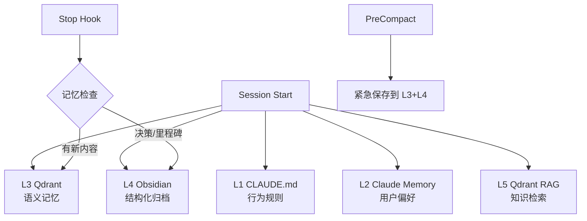

# GitHub 全仓库清理与展示 — 设计文档

Created: 2026-03-23

## Objective

将 ponytech-dev 下 7 个仓库按公开标准统一清理个人信息，补全 README 和 GitHub 设置，部署可视化面板到 GitHub Pages。

## Scope

### In Scope
1. 7 个仓库的文档级安全清理（邮箱、本地路径）
2. 5 个缺失 README 的项目创建 README（中英双语）
3. 2 个已有 README 的项目更新
4. 7 个仓库的 GitHub About + Topics 设置
5. ponymemory GitHub Pages 部署 Knowledge Galaxy 可视化

### Out of Scope
- 功能代码中的硬编码路径/token/密码（避免影响开发）
- GitHub Organization 创建或迁移
- Release 管理
- CI/CD 配置

## 仓库清单

| 仓库 | 可见性 | README 现状 | 清理项 |
|------|--------|------------|--------|
| ponymemory | 公开 | 无 | 路径 |
| MetaboFlow | 公开 | 有(229行) | 路径、加 badges |
| ponywriterX | 私有→将公开 | 无 | 邮箱、路径、galaxy-data.json |
| ponylabASMS | 私有→将公开 | 有(323行,badge占位符) | 邮箱、路径、.venv312 |
| ponylab | 私有 | 无 | 邮箱 |
| spaflow | 私有 | 无 | 邮箱、路径 |
| jiajun-agent-system | 无 remote | 无 | 邮箱、路径（不 push） |

## Phase 1: 安全清理

### 替换规则

| 原始内容 | 替换为 | 适用范围 |
|---------|--------|---------|
| `hanjiajun1990216@gmail.com` | `<your-email>` | 文档/plans/prompts |
| `hanjiajun1990216@126.com` | `<your-email>` | 文档/plans/prompts |
| `jiajunagent@gmail.com` | `<agent-email>` | 文档/plans/prompts |
| `/Users/jiajun-agent/` | `~/` | 文档/plans 中的路径引用 |
| galaxy-data.json 中的 source_path | 相对路径 | ponywriterX |

### 特殊处理

- **ponylabASMS .venv312/**：`git rm -r --cached .venv312` + 加入 .gitignore，本地文件不删
- **CLAUDE.md 中的路径**：保留不改（本地 Claude Code 需要绝对路径）
- **git commit author**：不改
- **脚本代码**：不改

### 不清理的项（明确排除）

| 项目 | 文件 | 内容 | 排除原因 |
|------|------|------|---------|
| jiajun-agent-system | bin/gog-safe, scripts/*.sh | Gateway Token | 改了影响运行 |
| jiajun-agent-system | plans/*.md | Zotero API Key | 改了影响运行 |
| ponylab | tests/e2e/*.spec.ts | 测试密码 pi123456 | 改了影响测试 |
| ponylabASMS | scripts/*.py | 硬编码路径 | 改了影响脚本运行 |
| 全部 | CLAUDE.md | 绝对路径 | Claude Code 依赖 |

## Phase 2: README 创建/更新

### 模板结构（中英双语）

```markdown
<p align="center">
  <h1 align="center">ProjectName</h1>
  <p align="center">English one-liner<br/>中文一句话定位</p>
</p>

<p align="center">
  
  
  
</p>

## Features / 核心功能

## Architecture / 架构
[Mermaid diagram]

## Quick Start / 快速开始

## Documentation / 文档

## Ponytech Ecosystem / 生态系统
[Cross-references to other projects]

## License
```

### 各项目定位文案

| 项目 | English | 中文 |
|------|---------|------|
| ponymemory | Autonomous 5-tier memory system for Claude Code | Claude Code 全自动五层记忆系统 |
| ponywriterX | AI-powered scientific writing with execution-verified authenticity | AI 驱动的科研论文写作平台，执行验证保真 |
| ponylabASMS | Mass spectrometry data analysis platform with multi-engine aggregation | 质谱数据分析平台，多引擎聚合 |
| ponylab | AI-native Laboratory Information Management System (LIMS + ELN) | AI 原生实验室信息管理系统 |
| spaflow | SPA business management platform | SPA 门店管理平台 |
| MetaboFlow | Untargeted LC-MS metabolomics quad-workflow pipeline | 非靶向代谢组学四工作流集成分析系统 |
| jiajun-agent-system | Personal AI agent system | 个人 AI Agent 系统 |

### 架构图（Mermaid）

每个项目在 README 中嵌入 Mermaid 架构图。示例（ponymemory）：



## Phase 3: GitHub 仓库设置

### About 描述（每个仓库）

使用上方定位文案的 English 版本，160 字符以内。

### Topics（每个仓库）

| 项目 | Topics |
|------|--------|
| ponymemory | python, memory, ai-agents, rag, qdrant, obsidian, vector-database, long-term-memory, claude-code, autonomous-agents, llm, open-source |
| ponywriterX | python, scientific-writing, ai, metabolomics, llm, paper-writing, research-automation, claude-code, bioinformatics, open-source |
| ponylabASMS | python, mass-spectrometry, metabolomics, data-analysis, bioinformatics, xcms, lims, open-source, scientific-computing |
| ponylab | python, typescript, nextjs, lims, eln, laboratory, ai, open-source |
| spaflow | typescript, nextjs, spa-management, business, saas |
| MetaboFlow | r, metabolomics, lcms, pathway-enrichment, tidymass, bioinformatics, data-analysis, open-source |
| jiajun-agent-system | python, ai-agents, claude-code, automation, personal-assistant |

## Phase 4: GitHub Pages（ponymemory）

### 部署方案

1. 在 ponymemory 仓库创建 `docs/` 目录
2. 将 Knowledge Galaxy 静态 HTML + galaxy-data.json 复制到 `docs/`
3. galaxy-data.json 中的 source_path 清理为相对路径
4. GitHub Settings → Pages → Source: `main` branch, `/docs` folder
5. 访问地址：`https://ponytech-dev.github.io/ponymemory/`

### README 中的展示

```markdown
## Live Demo

<p align="center">
  <a href="https://ponytech-dev.github.io/ponymemory/">
    
    <br/><strong>→ Live Demo / 在线演示</strong>
  </a>
</p>
```

预览截图通过 Playwright 截图生成，存放在 `docs/assets/`。

## 执行顺序

1. Phase 1 安全清理（7 个仓库并行）
2. Phase 2 README 创建/更新（7 个仓库并行）
3. Phase 3 GitHub 设置（7 个仓库，gh CLI 批量执行）
4. Phase 4 GitHub Pages 部署（仅 ponymemory）
5. 全量 commit + push

## Success Criteria

- [ ] 7 个仓库的 git tracked 文件中无个人邮箱（CLAUDE.md 除外）
- [ ] 7 个仓库的文档中无 `/Users/jiajun-agent/` 路径（CLAUDE.md 除外）
- [ ] 7 个仓库都有 README.md（中英双语，含 badges + 架构图）
- [ ] 7 个仓库都有 GitHub About 描述 + Topics
- [ ] ponylabASMS .venv312 不再被 git tracked
- [ ] ponymemory GitHub Pages 可访问 Knowledge Galaxy 可视化
- [ ] 所有改动 commit + push 完成
